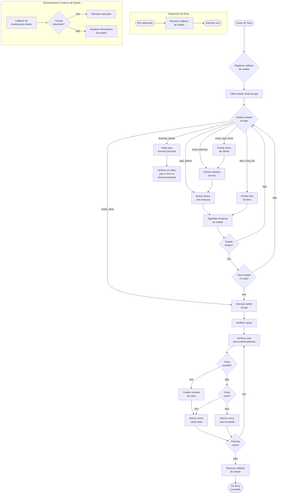

"""
# Fluxo de Funcionamento do Kit Terra

O diagrama abaixo mostra o fluxo completo da execução do Kit Terra, desde o início até a conclusão, incluindo a verificação e coleta de caixas vendidas.

## Explicação do Fluxo

1. **Inicialização**:
   - O Kit Terra inicia e registra um callback para monitorar mudanças de estado
   - Obtém o estado atual do jogo

2. **Navegação entre Estados**:
   - Dependendo do estado atual, executa ações específicas:
     - Na fazenda principal (jogo_aberto): Busca pela banca
     - Na interface do livro (book_interface): Fecha o livro e busca pela banca
     - No menu de cliente (menu_add_client): Fecha o menu, fecha o livro e busca pela banca
     - Na lista de itens (item_shop_list): Fecha a lista
     - Na fazenda de cliente (fazenda_cliente): Volta para a fazenda principal

3. **Verificação de Caixas na Loja**:
   - Quando chega à loja (inside_shop), verifica cada caixa individualmente
   - Para cada caixa:
     - Primeiro verifica se está vendida
     - Se estiver vendida, coleta as moedas automaticamente
     - Se não estiver vendida, verifica se está vazia
     - Cria uma lista das caixas vazias (incluindo as que foram coletadas)

4. **Finalização**:
   - Remove o callback de estado
   - Conclui a execução do Kit Terra

5. **Monitoramento Contínuo**:
   - Durante toda a execução, monitora mudanças de estado
   - Se detectar o tutorial de colheita, reinicia a execução
"""

# Fluxo de Funcionamento do Kit Terra

O diagrama abaixo mostra o fluxo completo da execução do Kit Terra, desde o início até a conclusão, incluindo a verificação e coleta de caixas vendidas.

## Explicação do Fluxo

1. **Inicialização**:
   - O Kit Terra inicia e registra um callback para monitorar mudanças de estado
   - Obtém o estado atual do jogo

2. **Navegação entre Estados**:
   - Dependendo do estado atual, executa ações específicas:
     - Na fazenda principal (jogo_aberto): Busca pela banca
     - Na interface do livro (book_interface): Fecha o livro e busca pela banca
     - No menu de cliente (menu_add_client): Fecha o menu, fecha o livro e busca pela banca
     - Na lista de itens (item_shop_list): Fecha a lista
     - Na fazenda de cliente (fazenda_cliente): Volta para a fazenda principal

3. **Verificação de Caixas na Loja**:
   - Quando chega à loja (inside_shop), verifica cada caixa individualmente
   - Para cada caixa:
     - Primeiro verifica se está vendida
     - Se estiver vendida, coleta as moedas automaticamente
     - Se não estiver vendida, verifica se está vazia
     - Cria uma lista das caixas vazias (incluindo as que foram coletadas)

4. **Finalização**:
   - Remove o callback de estado
   - Conclui a execução do Kit Terra

5. **Monitoramento Contínuo**:
   - Durante toda a execução, monitora mudanças de estado
   - Se detectar o tutorial de colheita, reinicia a execução
